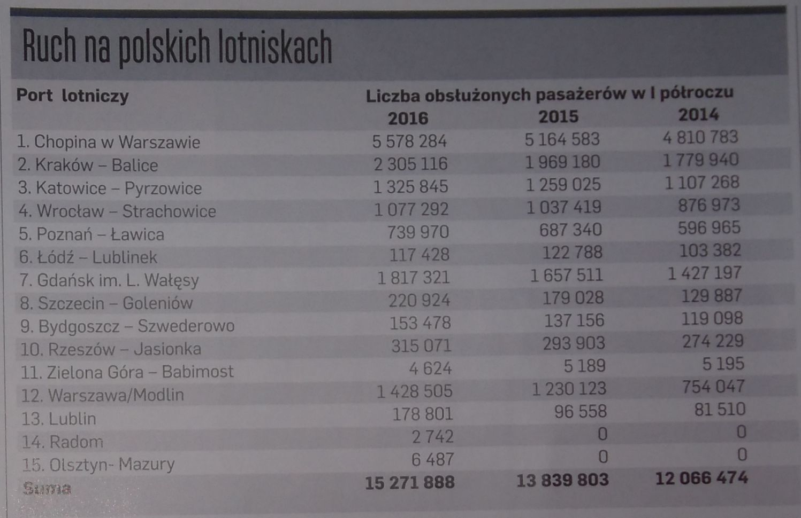

```{r setup, include=FALSE}
knitr::opts_chunk$set(echo = TRUE)
```
Artykuł, który mnie zainteresował pochodzi z dodatku do gazety "Puls Biznesu" z tego tygodnia i nosi tytuł "Długa droga do portu". 




```{r, echo=TRUE, message=FALSE, warning=FALSE}
dane <- data.frame( nazwa = c("Warszawa - Chopina", "Kraków - Balice", "Katowice - Pyrzowice", 
                              "Wrocław - Starachowice", "Poznań - Ławica", "Łódź - Lublinek", "Gdańsk im. L. Wałęsy",
                              "Szczecin - Goleniów", "Bydgoszcz - Szwederowo", "Rzeszów - Jasionka", 
                              "Zielona Góra - Babimost", "Warszawa/Modlin", "Lublin", "Radom", "Olsztyn - Mazury"),

                    rok_rozpoczecia = c(1934, 1964, 1964, 1945, 1945, 1927, 1974, 1967,1930,2005, 2001, 2012, 2012, 2016,
                                        1996),
                    pasazer2016 = c(5578284, 2305116, 1325845, 1077292, 739970, 117428, 1817321, 220924, 153478,
                                    315071, 4624, 1428505, 178801, 2742, 6487),
                    pasazer2015 = c(5164583, 1969180, 1259025,1037419, 687340, 122788, 1657511,179028, 137156,
                                    293903, 5189,1230123, 96558,0,0),
                    pasazer2014 = c(4810783, 1779940, 1107268, 876973, 596965, 103382, 1427197, 129887,
                                    119098, 274229, 5195,754047,81510,0,0),
                    wspolrzedna_E = c(20.967222, 19.785, 19.08, 16.886111, 16.826389, 19.398056, 18.466389,
                                      14.902222, 17.9775, 22.019167,  15.798611, 20.650833, 22.713333, 21.213611, 20.937778  ),
                    wspolrzedna_N = c(52.165833, 50.077778, 50.474444, 51.102778, 52.421111, 51.721944,54.3775,
                                      53.584722, 53.096667, 50.11, 52.138611, 52.451111, 51.24,51.389167,  53.481944 ))


dane$procenty20142015 <-  round((dane$pasazer2015 - dane$pasazer2014)/dane$pasazer2014 * 100,1)
dane$procenty20142015 <- ifelse( is.nan(dane$procenty20142015), 0, dane$procenty20142015 )

dane$procenty20152016 <- round((dane$pasazer2016 - dane$pasazer2015)/dane$pasazer2015 * 100,1)
dane$procenty20152016 <- ifelse( is.finite(dane$procenty20152016), dane$procenty20152016, 100 )


# mapa pobrana z http://www.codgik.gov.pl/index.php/darmowe-dane/prg.html

library(ggplot2)
library(sp)
library(rgdal)
library(maptools)

poland.map <- readOGR(dsn="wojewodztwa", "wojewodztwa")

EPSG <- make_EPSG()
EPSG[grepl("WGS 84$", EPSG$note), ]

poland.map <- spTransform(poland.map, CRS("+init=epsg:4326"))

poland.map.gg <- fortify(poland.map)


p <- 
ggplot() +
   geom_polygon(data = poland.map.gg, 
                aes(long, lat, group=group, fill=id ), 
                colour = "grey80", lwd=0.01, show.legend = F) +
   ggtitle("Ruch pasażerski w Polsce w I półroczach 2014-2016") + 
   geom_point(data=dane,aes(x=wspolrzedna_E,y=wspolrzedna_N, size=pasazer2016), colour="#fc8d59") +
   geom_text(data=dane, aes(x=wspolrzedna_E,y=wspolrzedna_N, label=nazwa), nudge_x = 0.1, nudge_y = 0.2, colour="grey20") +  
   scale_fill_manual(values = rep("#ffffbf",16))+
   xlab("")+ylab("")  +
   theme( panel.background=element_rect(fill="white"), panel.grid.minor=element_blank(),  
          plot.background=element_rect(fill="white"),
          plot.margin=unit(c(1,1,1,1),"cm"),
          plot.title = element_text(size = 20, face = "bold", colour = "black"),
          axis.ticks = element_blank(), axis.text.y = element_blank(), axis.text.x = element_blank(),
          legend.key = element_blank())+
   coord_fixed(ratio=3/2)+
   scale_size(range = c(1, 22), breaks = c(0, 10000, 100000, 1000000,2000000,5000000), 
              labels = c("0", "10 tys.", "100 tys.", "1 mln","2 mln","5 mln")) +
   guides(size = guide_legend(title="Liczba pasażerów w I półroczu 2016"))+
   
   geom_point(data=dane,aes(x=wspolrzedna_E+0.8,y=wspolrzedna_N, size=50000), 
              colour=ifelse(dane$procenty20142015 > 0, "#a6d96a", ifelse(dane$procenty20142015 < 0, "#de2d26", "grey" ))   , show.legend = F,
              shape=ifelse(dane$procenty20142015 > 0, 24, ifelse(dane$procenty20142015 < 0, 25, 21)) , 
              fill =ifelse(dane$procenty20142015 > 0, "#a6d96a", ifelse(dane$procenty20142015 < 0, "#de2d26", "yellow"  ))  ) +
   
   geom_point(data=dane,aes(x=wspolrzedna_E+1.05,y=wspolrzedna_N, size=50000), 
              colour=ifelse(dane$procenty20152016 > 0, "#a6d96a", ifelse(dane$procenty20152016 < 0, "#de2d26", "grey" ))   , show.legend = F,
              shape=ifelse(dane$procenty20152016 > 0, 24, ifelse(dane$procenty20152016 < 0, 25, 21)) , 
              fill =ifelse(dane$procenty20152016 > 0, "#a6d96a", ifelse(dane$procenty20152016 < 0, "#de2d26", "yellow"  ))  )+
   annotate(geom = "text",x = 18.8, y=48, label = "(kształtami zaznaczono wzrost lub spadek (lub brak zmian - kółko) liczby pasażerów 
w porównaniu do poprzedniego I półrocza: między 2014, a 2015 oraz między 2015, a 2016)")


```

```{r,echo=F, out.width = '800px', out.height = '800px', fig.align='center', fig.width=10, fig.height=8}
p
```