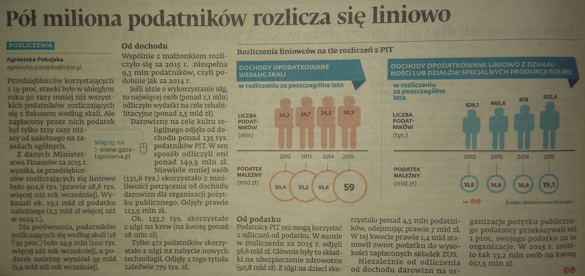

```{r setup, include=FALSE}
knitr::opts_chunk$set(echo = TRUE)
```


Artykuł, który zainteresował mnie tym razem pochodzi z gazety "Gazeta Prawna" z dnia 25 października 2016 i nosi tytuł: "Pół miliona podatnników rozlicza się liniowo". 



W artykule umieszczono grafikę, która ma porównywać wielkości związane z rozliczaniem się w systemie PIT i systemie liniowym. To co mnie uderzyło w tej grafice to niezachowanie odpowiednich proporcji między liczbami. Mimo to, że mamy tam 2 wykresy, a więc i 2 osie y (jedna w mln, druga w tys.), to uważam, że użycie takich rozmiarów "ludzików" może wprowadzać w błąd. 

W artykule zaznaczono istotną kwestię proporcji w liczbie podatników i podatku należnego między rozliczaniem w PIT a w s. liniowym, tj. stosunek liczby podatników wynosi aż 50 na korzyść PIT-u, ale juz tylko 3 jeśli chodzi o kwotę należnego podatku. Uznałam, że to dość ważna informacja, którą również warto uwzględnić na wykresie. W tym celu policzyłam kwotę podatku przypadającą na 1 podatnika w obu systemach, którą wraz z liczbą podatników i całkowitą kwotą podatku umieściłam na wykresie. Dane, które rozważałam pochodziły tylko z 1 roku (2015), gdyż dla wcześniejszych lat nie następowały gwałtowne zmiany tych wielkości, zatem rok 2015 można uznać za reprezentatywny dla tych wielkości. Do tego celu użyłam skumulowanego wykresu słupkowego. Dzięki niemu możemy łatwo ocenić proporcje między poszczególnymi wielkościami dla obu grup. I tak jak mogło się zdawać na podstawie oryginalnej grafiki, że liczby podatników nie różnią się tak dramatycznie, tak tutaj widać, że te różnice są bardzo znaczące. Słupki ułożyłam w kolejności rosnących proporcji na korzyść podatku liniowego, aby było wiadome jakie są charakterystyki tego systemu podatkowego (wysoka kwota podatku przypadająca na 1 podatnika, ale niska liczba osób korzystająca z tej opcji). Dodatkowo dodałam liczby, aby wiadomo było o jakich ilościach mówimy.

Z wniosków mniej formalnych mogę dodać, że przerabianie czyjegoś wykresu okazało się o wiele trudniejsze i dłuższe niż tworzenie własnego na podstawie danych tabelarycznych oraz że zdaje sobie sprawę ze "zgubienia" większości danych  (tj. danych dla lat poprzednich), ale uznałam, że najciekawsze w tym temacie są te proporcje + informacja o bezwględnych wielkościach (tj. np. "mamy 25 mln podatników z PIT-u")

```{r}

dane1 <- data.frame(co = c("liczba podatników", "podatek należny", "średnia kwota podatku\n na 1 podatnika",
                           "liczba podatników", "podatek należny", "średnia kwota podatku\n na 1 podatnika"),
                   liczby = c(502.6*1000, 19.1*1000000000, 19.1*1000000000/(502.6*1000), 
                              24.9*1000000, 59*1000000000, 59*1000000000/(24.9*1000000)),
                   ktore = c("liniowy", "liniowy", "liniowy", "PIT", "PIT", "PIT"))

library(ggplot2)

dane1$co<- factor(dane1$co, levels = c( "średnia kwota podatku\n na 1 podatnika","podatek należny","liczba podatników"), ordered = T)

p <- ggplot(data=dane1, aes(x=co, y=liczby, fill=ktore)) +
   geom_bar(stat="identity", position = "fill", width = 0.95, color="blue") +coord_flip()+
   geom_abline(slope=0, intercept = 0.5, colour="white")+
   scale_fill_manual("podatek", values=c('#FF963F','#6282CD'))+
   theme(legend.position="bottom", axis.ticks=element_blank(), 
         panel.background=element_rect(fill="white"), panel.grid.minor=element_blank(),  
         plot.background=element_rect(fill="white"),
         plot.margin=unit(c(1,1,1,1),"cm"),
         plot.title = element_text(size = 20, face = "bold", colour = "black"),
         axis.text.y = element_text(size = 12, face = "bold", colour = "black"), 
         legend.title = element_text(size = 13 ),
         legend.text = element_text(size=13))+
   geom_label(aes(label = c("59 mld zł","19.1 mld zł","24.9 mln osób", "0.5 mln osób","38 tys. zł","2 tys. zł" ), 
                 y=c(0.6, 0.12, 0.5,0.03,0.5, 0.97), 
                 x = c(2,2,3,3,1,1), colour="white"), inherit.aes = F, show.legend = F, colour="blue", size=6)+
   labs(title="Rozliczenia liniowców na tle rozliczeń z PIT na rok 2015", y = "proporcja",x="")
  
```


```{r,echo=F, out.width = '1000px', out.height = '800px', fig.align='center', fig.width=14, fig.height=8}
p
```
