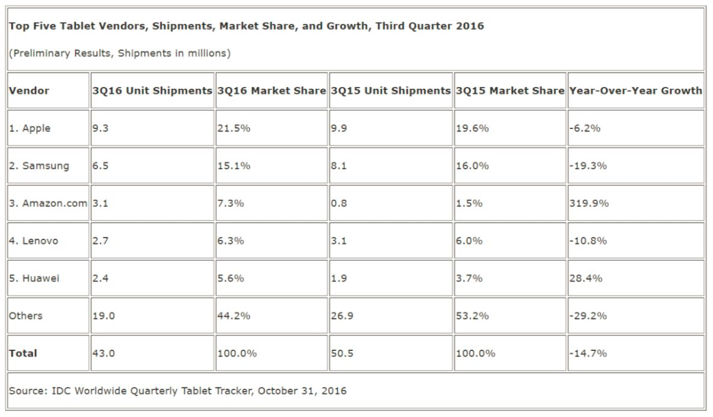

```{r setup, include=FALSE}
knitr::opts_chunk$set(echo = TRUE)
```
W tym tygodniu zajęłam się danymi dotyczącymi sprzedaży tabletów (https://www.tabletowo.pl/2016/11/01/rynek-tabletow-sie-kurczy-rosnie-popyt-na-hybrydy-spojrzcie-na-podium/). Tabela z danymi, które przedstawiłam na wykresie wyglądała tak:



Znajduje się w niej 5 największych sprzedawców tabletów w III kwartale 2016 roku wraz podaną dla nich liczbą sprzedanych produktów (w mln), procentami udziału na rynku oraz analogiczne dane dla zeszłego roku. Dodatkowo dodano róznicę procentową pomiędzy III kwartałem 2016 roku, a III kwartałem 2015 roku.

Dane są dość proste i jest ich mało, więc aby je uatrakcyjnić przedstawiłam je na wykresie typu "treemap". Choć wiem, że ten typ wykresu  w większości przypadków przegrywa z wykresem słupkowym pod względem komunikatywności  (http/www.theinformatub.co.ałatwićk/2014/12/16/treemap-vbar-chart-end-tru/), to uznałam, że i tak warto się o tym ew. przekonać samemu.

Na wykresie przedstawiłam liczby zamówień w mln dla każdego z producentów (łącznie z kategorią "Pozostali"), których rozmiary i wzajemne relacje (proporcje do całości) przedstawione są za pomocą wielkości prostokątów. Aby móc łatwo porównywać te wielkości (choćby pod względem kolejności (tj. Apple pierwszy, potem Samsung potem...) zadbałam o to, aby prostokaty nie miały zbyt różnych długości boków.  Dwie największe kategorie (poza "Pozostali") mają taką samą długość, podobnie mniejsze - to co je odróżnia od siebie to wysokość tych prostokątów - pozwala to, w moim odczuciu, porównać jednak dość efektywnie pola tych figur i wyciągnąć prawidłowe wnioski na temat udziału poszczególnych firm na rynku.

Aby dodatkowo ułatwić odczytanie kolejności tych liczb uzależniłam nieznacznie wielkość etykiet z nazwami firm od ich wielkości oraz dodałam same liczby na wykres. Jedyny wyjątek dotyczy kategorii "Pozostali", której etykietę zmieniłam na mniejszą, aby nie górowała nad wykresem.

Dodatkowym wymiarem wykresu są kolory, które ukazują wzrosty/spadki w liczbie sprzedanych tabletów. Same procenty zostały podane w legendzie jako nazwy kolorów. Taki dobór kolorów pozwolił na 2 rzeczy: po pierwsze wyróżnienie największego sprzedawcy, firmy Apple, poprzez dodanie etykiety w kontrastującym kolorze, a po drugie wyróżnienie Amazon.com, który miał największy wzrost sprzedaży.

Kolor tła wybrany został tak, aby podkreślić delikatne barwy zastosowane na wykresie. Użycie standardowego białego tła sprawiłoby, że barwy wydałyby się zbyt mdłe. Poza tym wymagałoby to użycia intensywnego koloru do tytułu podtytułu i legendy, co niepotrzebnie by odciągało uwagę od samego wykresu.

```{r, message=F, warning=F}
library(ggplot2)
library(treemapify)

dane <- data.frame( ile = c( 3.1, 2.4, 9.3, 2.7, 6.5, 19.0),
                    kto = c( "Amazon.com", "Huawei", "Apple", "Lenovo", "Samsung", "Pozostali"),
                    zmiana = c("  319.9%", "  28.4%", " -6.2%", " -10.8%", " -19.3%", " -29.2%"))

dane$zmiana <- factor(dane$zmiana, levels = c("  319.9%", "  28.4%", " -6.2%", " -10.8%", " -19.3%", " -29.2%"))

treeMapCoordinates <- treemapify(dane,
                                 area = "ile",
                                 fill = "zmiana", xlim=c(0,20), ylim=c(0,30))

wspol <- c( 6.5 ,9.3 ,19.0/9, 2.4, 2.7,3.1)/sum(c( 6.5 ,9.3 ,19.0, 2.4, 2.7,3.1))

p <-  ggplotify(treeMapCoordinates) + theme(legend.position="right", legend.title= element_text(size=18, colour="white"),
                                            legend.background = element_rect(fill="black", colour = "black"),
                                            legend.text = element_text(size=14, colour= "white"),
                                            panel.grid.minor=element_blank(),   panel.grid.major=element_blank(),
                                            panel.background = element_rect(fill="black"),
                                            plot.background =element_rect(fill="black"),
                                            plot.margin=unit(c(1.5,1.5,1.5,1.5),"cm"),
                                            plot.title = element_text(size = 22, face = "bold", colour= "white" ))+
   scale_fill_manual( values = c("#006d2c", "#74c476", "#fee5d9", "#fcae91", "#fb6a4a", "#de2d26"))+
   annotate("text", xmin=c(5,5,5,17,17,17)-3,x=c(7,7,7,17.3,17.3,17+0.7)-1,
            y=c(28, 20, 10, 28, 23, 17.2), 
            label=c( "Samsung", "Apple", "Pozostali", "Huawei","Lenovo", "Amazon.com"),
            color= c("white", "red", rep("white",4)), 
            size=wspol*25+7, alpha = 0.7)+
       annotate("text", xmin=c(5,5,5,17,17,17)-3, x=c(7,7,7,17.3,17.3,17.7)-1,
            y=c(28, 19.4, 10.4, 28.4, 23.4, 17.4)-2, 
            label=as.character(paste( c( 6.5 ,9.3 ,19.0, 2.4, 2.7,3.1), "mln", sep = " ")) ,
            color= c("white", "red", rep("white",4)) , 
            size=wspol*25+3, alpha = 0.7)

p <- p +   ggtitle(expression(atop("Liczba sprzedanych tabletów na świecie \n             w III kwartale 2016 roku",
                                   scriptstyle(italic("(zmiana proc. w porównaniu do III kw. 2015 r.)"), ""))))


```
```{r,echo=F, out.dth = '1000px',out.heig = '800px', fig.align='center', fig.width=10, fig.height=8}
p
```

