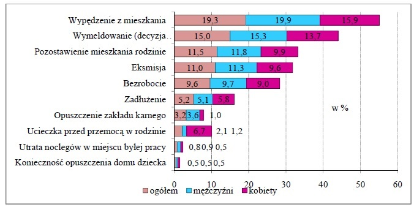

```{r setup, include=FALSE}
knitr::opts_chunk$set(echo = TRUE)
```


## Poprawa wykresu ze spisu powszedniego GUSu.

Poprawiany by³ wykres dotycz¹cy wykresu przyczyn bezdomnoœci ludzi (Wykres 25) ze spisu powszechnego z 2011 roku (strona 132). Poni¿ej znajduje siê wykres z broszury:
 


Zaœ wersja wykonana przeze mnie wygl¹da nastêpuj¹co:

```{r  echo=FALSE, message = FALSE, warning= FALSE}


dane <- matrix(c(19.3,19.9,15.9,
  15,15.3,13.7,
  11.5,11.8,9.9,
  11,11.3,9.6,
  9.6,9.7,9,
  5.2,5.1,5.8,
  3.2,3.6,1.0,
  2.1,1.2,6.7,
  0.8,0.9,0.5,
  0.5,0.5,0.5), ncol=3, byrow=TRUE)


nazwy <- c('Wypêdzenie z mieszkania',
           'Wymeldowanie',
           'Pozostawienie mieszkania rodzinie',
           'Eksmisja',
           'Bezrobocie',
           'Zad³u¿enie',
           'Opuszczenie zak³adu karnego',
           'Ucieczka przed przemoc¹ w rodzinie',
           'Utrata noclegów w miejscu by³ej pracy',
           'KoniecznoϾ opuszczenia domu dziecka')


library(ggplot2)
library(tidyr)

DaneDoObrobki <- data.frame(nazwy,dane)
colnames(DaneDoObrobki) <- c("Nazwy", "Ogó³em","Mê¿czyŸni","Kobiety")

Gotowe <- DaneDoObrobki %>% gather(typ,procent,-Nazwy)
noweGotowe <- Gotowe[Gotowe$typ != "Ogó³em",]
#kolejnosc usawiona z roznica miedzy p³ciami
noweGotowe2 <- noweGotowe
noweGotowe2$Nazwy <- reorder(noweGotowe$Nazwy,noweGotowe$procent,function(x) x[1])
  
```

```{r  echo=FALSE, message = FALSE, warning= FALSE}

  ggplot(noweGotowe2,aes(x=Nazwy,y=procent, fill=typ)) + 
  geom_bar(aes(fill=typ),position="dodge",stat="identity") +
  geom_text(aes(label=procent), position=position_dodge(width=0.9),
   vjust=0.4, hjust=-0.2)+
  theme(axis.title.y=element_blank(),
        legend.position="bottom"
        ) +
  ggtitle("Przyczyny bezdomnoœci wed³ug p³ci osób bezdomnych") +
  ylim(c(0,21))+
  ylab("Procent [%]")+
  coord_flip()
```

