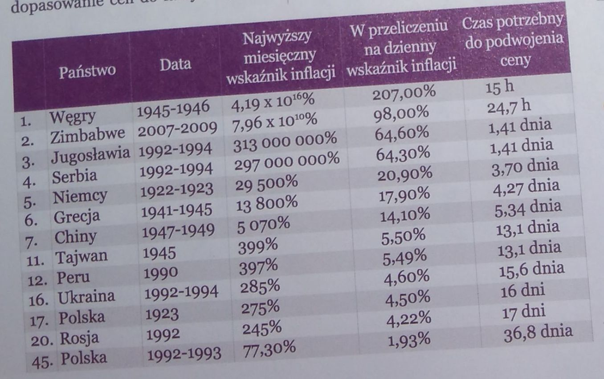

```{r setup, include=FALSE}
knitr::opts_chunk$set(echo = TRUE)
```

W tym tygodniu znalazłam w magazynie Bloombergnews Polska z listopada 2016 roku artykuł o hiperinflacjach w historii współczesnego świata. Zamieszczona była w nim poniższa tabelka:



W tabelce zawarte jest 13 przypadków hiperinflacji wraz z podanymi dla nich państwami, datami oraz 3 wskaźnikami inflacji.
Tak naprawdę każdy z tych wskaźników przedstawia tą samą informację, jednak ze względu na rodzaj tych wskaźników mają one różną skalę i interpretację (łatwiejszą/trudniejszą). Najbardziej rozróżniającym wskaźnikiem jest wskaźnik miesięcznej inflacji (różnicę rzędu 10^16), który pokazuje jak wielka była skala inflacji dla Węgier w porównaniu z pozostałymi krajami, jednak takie różnice ciężko zawrzeć na jednym wykresie. Z tego powodu zdecydowałam się użyć 2 pozostałych wskaźników, które mają mniejszy rozrzut i są łatwiejsze w interpretacji.

Stworzony przeze mnie wykres jest typu punktowego, gdzie na osi x przedstawiono czas w latach, z wyszczególnionymi istotnymi datami, a na osi y mnożnik cen z dnia na dzień (obliczony na podstawie wskaźnika dziennego inflacji), który wydaje mi się przystępniejszą wielkością w interpretacji niż procentowa inflacja. Na wykresie zaznaczyłam kolejne państwa wraz z informacją o zakresie czasowym inflacji i czasie do podwojenia się cen. Podanie tych wielkości jest poniekąd powielaniem informacji z osi, jednak uznałam, że czas do podwojenia sie cen jest informacją dobrze zapamietywalną i interpretowalną i pobudzającą wyobraźnię w pewien sposób (przynajmniej w moim przypadku pierwszą myślą było przelicznie sobie np. tych 15h dla Węgier na czas, w którym wykonuje pewne czynności, np. wstaje rano i kupuje coś za 5 zł, a wieczorem po powrocie z uczelni kupuje to samo już za 10 zł). Dodatkowo, podzieliłam kraje ze względu na tą wielkość na 2 grupy: grupa dla której cena podwaja się w mniej niż tydzień i grupa, dla której podwaja się dłużej - tą informację zaznaczyłam na wykresie kolorami punktów, zamieszczając opis grup w legendzie.

Dodatkowo dla Polski i Węgier (nr 1 w rankingu) dodałam krótki opis hiperinflacji oraz zaznaczyłam 3 szarymi pasami istotne historycznie momenty czasowe, które wpłynęły na te zjawiska hiperinflacji. Całość przypomina bardziej infografikę niż wykres z danymi, ale też taki był mój cel. 

(Wykres można na pewno poprawić (dodając intensywniejszy kolor dla Polski, zmieniając wielkość kropek w zależności od czasu do podwojenia sie cen lub zamieniając je na paski, które dodatkowo informowałyby o długości trwania tej hiperinflacji - teraz nie widać, że najdłużej trwała w Grecji i skrócić opisy, ale na to nie starczyło mi już czasu niestety. W każdym razie główny pomysł na przedstawienie tych danych został zrealizowany.)

(link do wykresu: https://raw.githubusercontent.com/flaminka/TechnikiWizualizacjiDanych/master/MINI_2016/PraceDomowe/Tydzien06/BaranowskaEwa/wykres1.PNG)


```{r, eval=F}

dane1 <- data.frame(ranking = c(1,2,3,4,5,6,7,11,12,16,17,20,45),
                   kraj = c("Węgry", "Zimbabwe", "Jugosławia", "Serbia", "Niemcy", "Grecja",
                            "Chiny", "Tajwan", "Peru", "Ukraina", "Polska", "Rosja", "Polska"),
                   data = c("1945", "2007", "1992", "1992", "1922",
                            "1941", "1947", "1945", "1990", "1992", "1923",
                            "1992", "1992"),
                   data_cal = c("1945-1946", "2007-2009", "1992-1994", "1992-1994", "1922-1923",
                            "1941-1945", "1947-1949", "1945", "1990", "1992-1994", "1923",
                            "1992", "1992-1993"),
                   mies_infl = c(4.19*10^16, 7.96*10^10, 313000000, 297000000, 29500, 13800,
                                 5070, 399, 397, 285, 275, 245, 77.30),
                   dzien_infl = c(207, 98, 64.60, 64.30, 20.90, 17.90, 14.10, 5.50, 5.49, 4.60,
                                  4.50, 4.22, 1.93),
                   czas_do_podw = c("15 h", "24.7 h", "1.41 dnia", "1.41 dnia", "3.7 dnia",
                                    "4.27 dnia", "5.34 dnia", "13.1 dnia", "13.1 dnia", 
                                    "15.6 dnia", "16 dni", "17 dni", "36.8 dnia"),
                   stringsAsFactors = F)

dane1$godziny <- c(15, 24.7, 1.41*24, 1.41*24,3.7*24, 4.27*24, 5.34*24, 13.1*24, 13.1*24, 15.6*24,
                   16*24, 17*24, 36.8*24)

dane1$godziny_size <- (900 - dane1$godziny)
dane1$mies_size <- (dane1$mies_infl - median(dane1$mies_infl))/(var(dane1$mies_infl))^(0.5)*10+5

dane1$data <- as.numeric(dane1$data)
dane1$grupy <- as.factor(ifelse(dane1$godziny >7*24, 1,2))
dane1$kolor_srodek <- ifelse(dane1$godziny >7*24, "#d5effc","#f69787")
dane1$kolor_obrecz <- ifelse(dane1$godziny >7*24, "#73c2e0","#ed293f")

dane1$etykietki <- paste0(dane1$kraj, " ", dane1$data_cal, "\n","(", dane1$czas_do_podw, ")")
dane1$etykietki <- ifelse(dane1$kraj =="Serbia", "", dane1$etykietki)
dane1$etykietki <- ifelse(dane1$kraj =="Jugosławia", "Jugosławia/Serbia 1992-1994\n(1.41 dnia)", dane1$etykietki)


library(ggplot2) 
library(ggrepel)

p <- ggplot(data=dane1,aes(x=data, y=dzien_infl))+
   annotate("rect", ymin=-5, ymax=218, xmin=1939, xmax=1945, fill="black", alpha=0.05)+
   annotate("rect", ymin=-5, ymax=218, xmin=1989, xmax=1992, fill="black", alpha=0.05)+
   annotate("rect", ymin=-5, ymax=218, xmin=1914, xmax=1918, fill="black", alpha=0.05)+
   annotate("text", x=1942, y=218,label="II wojna światowa", colour="gray70")+
   annotate("text", x=1991, y=218,label="upadek komunizmu w Europie", colour="gray70")+
   annotate("text", x=1916, y=218,label="I wojna światowa", colour="gray70")+
  geom_point(aes(colour=grupy, fill=grupy), size=8, stroke = 1.4 ,shape=21, alpha=0.9)+
   labs(title = "Rekordowe hiperinflacje w historii współczesnego świata",
        subtitle = "Maksymalny wzrost cen w ciągu jednego dnia*",
        caption=("* obliczony na podstawie maksymalnej hiperinflacji miesięcznej przy założeniu stałego wzrostu dziennego"))+ xlab("")+ylab("mnożnik cen z dnia na dzień")+
   scale_color_manual(values=c("#528BA0","#ed293f"), name="(czas do podwojenia się cen)",
                      labels=c("więcej niż tydzień", "mniej niż tydzień"))+
   scale_fill_manual(values=c("#d5effc","#f69787"),name="(czas do podwojenia się cen)",labels=c("więcej niż tydzień", "mniej niż tydzień"))+
   scale_x_continuous(breaks = c(1914,1922, 1941, 1945, 1990, 2007,2016, seq(1920,2015,by=10)), limits=c(1912, 2016),labels=c("1914","1922", "1941", "1945", "1990", "2007","2016", rep("",length(seq(1920,2015,by=10))) ) ,expand = c(0,0)  )+
   scale_y_continuous(breaks=c(0,50,100,150,200), labels = c("bez zmian", "1.5 raza",
 "2 razy", "2.5 raza", "3 razy"),limits=c(-5,222), expand = c(0,0))+
   theme(panel.background=element_rect(fill="white"), 
         panel.grid.minor.x =element_blank(),   panel.grid.major.y=element_line(color="gray90"), 
         panel.grid.major.x=element_line(colour="white"),   plot.background=element_rect(fill="white"),
         plot.title = element_text(size = 25, face = "bold", colour = "black", vjust=0, hjust=0),
         plot.subtitle = element_text(size = 18, face = "plain", colour = "black", vjust=0, hjust=0),
         axis.title= element_text(size = 12, face = "plain", colour="gray20", vjust=0, margin = margin(r = 1)), 
         axis.text.y = element_text(size=12, face="plain", colour="gray20"),
         axis.text.x = element_text(size=12, face="plain", colour="gray20", margin = margin(t = 0)),
         axis.ticks.length = unit(c(0.2),"cm"), axis.ticks.x=element_line(colour="gray60"),
         axis.ticks.y = element_blank(),    plot.margin=unit(c(1,1,1,1),"cm"),
         legend.key = element_blank(),   legend.text = element_text(size=10),
         legend.title = element_text(face = "plain", size=12 ), legend.position = "top")+
   geom_text_repel(aes(label=etykietki,colour=grupy), show.legend = F,  segment.color = NA ,
                   point.padding = unit(0.8, 'lines'), alpha=0.8, size=5)+
      geom_segment(aes(x = 1945, y = 207, xend = 1960, yend = 207), colour = "#ed293f")+
   geom_label(aes(label="Największa hiperinflacja w historii. W szczytowym momencie\nwynosiła 41 900 000 000 000 000% w skali miesiąca,\nco oznaczało podwajanie się cen co 15 godzin.", x= 1960, y=207), colour="#ed293f",size=3.6)+
   geom_segment(aes(x = 1923, y = 4.50, xend = 1923, yend = 100), colour = "#528BA0")+
   geom_label(aes(label="Po I w.ś. rosnący deficyt budżetowy doprowadził w 1923\ndo hiperinflacji wynoszącej maks. 275% w skali miesiąca\n(co oznaczało podwajanie się cen co 16 dni).\nZostała ona opanowana w wyniku reform Grabskiego,\nktóry zastąpił markę polską złotym polskim.", x= 1926, y=100), colour="#528BA0", size=3.6)+
   # geom_segment(aes(x = 2007, y = 98, xend = 2007, yend = 150), colour = "#ed293f")+
   # geom_label(aes(label="W wyniku polityki prezydenta Roberta Mugabe\n(drastyczne zmiany społ., dodruk pieniędzy)\ninflacja skoczyła maks. do 79 600 000 000% w skali\n miesiąca, co oznaczało podwajanie się cen co 25 godzin.", x= 2003, y=150), colour="#ed293f", size=3.6)+
   geom_segment(aes(x = 1967, y = 1.93, xend = 1992, yend = 1.93), colour = "#528BA0")+
   geom_segment(aes(x = 1967, y = 1.93, xend = 1967, yend = 50), colour = "#528BA0")+
   geom_label(aes(label="Po upadku PRL-u i uwolnieniu cen na rynku\n maks. inflacja mies. wyniosła 77,30%\n(podwojenie cen co 37 dni).\nUdało się ją opanować w wyniku reformy Balcerowicza\ni wprowadzeniu nowej waluty (PLN).", x= 1967, y=50), colour="#528BA0", size=3.6)
```
