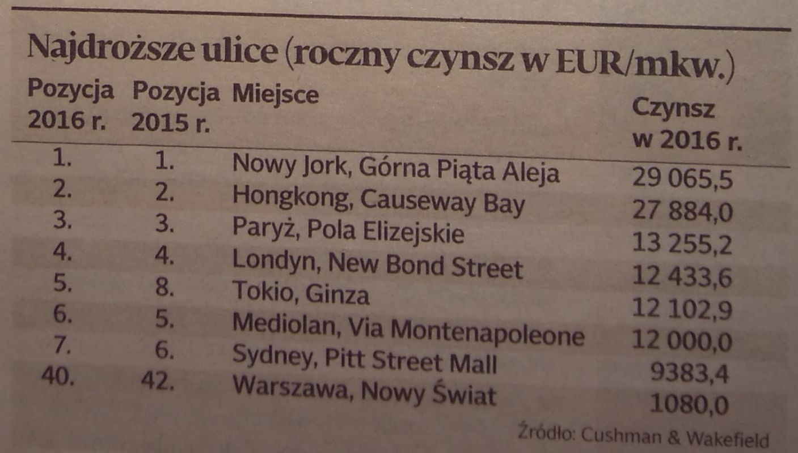

W tym tygodniu zajęłam się danymi z artykułu "Nowy Świat podrożał" z gazety Dziennik Gazeta Prawna z dnia 22 listopada 2016 roku. W artykule zamieszczona była poniższa tabelka:

Powyższe dane przedstawiłam przy użyciu biblioteki Highcharts w postaci podwójnego wykresu interaktywnego. Z lewej strony przedstawiłam wykres typu "slope chart", na którym widoczne są zmiany w rankingu dla wybranych ulic na przestrzeni lat 2015-2016. Po najechaniu na odpowiedni ranking (dla roku 2015 lub 2016) wyświetla się informacja o ulicy, która zajmowała w danym roku tą pozycję. Zmiany są prezentowane tutaj za pomocą nachylenia linii oraz koloru, co pozwala na szybkie zaobserwowanie zmian w rankingach (widzimy np., że pierwsze 4 pozycje nie uległy zmianie z roku na rok). Dodatkowo na wykresie zostały umieszczone etykiety z pozycją w rankingu, aby móc od razu ocenić ranking dla każdej z ulicy (szczególnie istotne jest to dla Warszawskiego Nowego Świata, który znajduje się znacznie poniżej pierwszej dziesiątki).
Z prawej strony zamieszczony jest wykres słupkowy przedstawiający wielkość czynszu dla danej ulicy. W artykule wielkości te zostały przedstawione w euro w perspektywnie rocznej, jednak uznałam, że łatwiej odnieść się do liczb w perspektywne miesięcznej przeliczonych na PLN i takie też wartości umieściłam na wykresie. Po najechaniu na koniec słupka wyświetla się informacja o ulicy, rankingu oraz miesięcznym czynszu w PLN za 1 metr kwadratowy. Kolory słupka został celowo wybrany na szary, aby nie dominował on wykresu i przykuwał do siebie uwagę dopiero w drugiej kolejności. 
To co można zaobserwować na tym wykresie, a czego nie było widać tak łatwo w tabeli to fakt, że dla 2 pierwszych ulic wartość czynszu jest prawie 2 krotnie większa niż dla 3 pozycji.

Dodatkową opcją na wykresie jest możliwość ukrycia danych dla Warszawskiego Nowego Świata, co z jednej strony, po ukryciu, zwraca pozwala lepiej skupić się na czołowej ósemce, a z drugiej strony, wyróżnia akurat tą ulicę na wykresie (cały czas na wykresie jest widoczna informacja o istnieniu polskiej ulicy w tym rankingu).

Przydatność kodu do przyszłych użyć jest na tą chwilę znikoma, dane są zapisane w kodzie "na sztywno", jednak wizja wykresu została mniej więcej zrealizowana. Dalsze oswajenie z tym pakietem, mam nadzieję, poprawi optymalność rozwiązań użytych w tym kodzie. 

Wykres jest dodany jako plik htmlowy do folderu,  znajduje się też pod adresem: https://rawgit.com/flaminka/TechnikiWizualizacjiDanych/master/MINI_2016/PraceDomowe/Tydzien07/BaranowskaEwa/wykres1.html

```{r, eval=F}

dane <- data.frame( poz_2015 =  c(1,2,3,4,8,5,6,42),
                    poz_2016 = c(1,2,3,4,5,6,7,40),
                    miejsce = c("Nowy Jork, Górna Piąta Aleja",
                                "Hongkong, Causeway Bay",
                                "Paryż, Pola Elizejskiej",
                                "Londyn, New Bond Street",
                                "Tokio, Ganza",
                                "Mediolan, Via Montenapoleone",
                                "Sydney, Pitt Street Mall",
                                "Warszawa, Nowy Świat"),
                    czynsz_rok_EUR = c(29065.5, 27884.0, 13255.2,
                                       12433.6, 12102.9, 12000.0,
                                       9383.4, 1080.0))
dane$czynsz_mies_PLN <- dane$czynsz_rok_EUR*4.4/12
dane$czynsz_mies_PLN_norm <- as.character(dane$czynsz_rok_EUR*4.4/12/max(dane$czynsz_rok_EUR*4.4/12)+2016.2)

library(rCharts)


wykres <- Highcharts$new()
wykres$chart(renderTo="container")
wykres$title(text="Ranking najdroższych ulic handlowych świata w latach 2015-2016",
             style = list(color="black",
                          fontWeight="bold",
                          fontSize="24"))
wykres$subtitle(text = "ze względu na miesięczny czynsz w PLN za mkw",
                style = list(color="black",
                             fontWeight="plain",
                             fontSize="18"))
#wykres$xAxis(categories = c(2015,2016, 2016.2, 2017.2))
wykres$yAxis(title="",
             lineColor= 'transparent',
             tickLength= 0,
             gridLineWidth= 0,
             minorGridLineWidth= 0,
             lineWidth= 0,
             labels =list(enabled=F),
             reversed=T)
wykres$xAxis(title="",
             lineColor= 'transparent',
             tickLength= 0,
             gridLineWidth= 0,
             minorGridLineWidth= 0,
             lineWidth= 0,
             labels =list(enabled=T,
                          formatter ="#! function(){
                        if(this.value == 2015 || this.value == 2016){
                         return this.value;}
                        if(this.value == 2016.5) {
                            return 'Czynsz w 2016 roku: ';
                        }; } !#"
                          ),
             opposite=T)

wykres$series(type="line", name = "Warszawa, Nowy Świat", data=list(c(2015,16),c(2016,14)),
              marker = list( fillColor= '#ff7500', radius= 6, symbol="circle" ),
              lineWidth=5, lineColor="#ff7500", color="#ff7500",
              dataLabels = list(
                 enabled=T,
                 formatter= "#! function(){
                 if(this.series.name == 'Warszawa, Nowy Świat'){
                 a =  parseFloat(this.point.y+26);}
                 else{
                 a = this.point.y;
                 };
                 return  a
                 ;}
                 !#"
                 ))
wykres$series(type="line", name = "Sydney, Pitt Street Mall", data=list(c(2015,6),c(2016,7)),
              marker = list( fillColor= '#006a9d', radius= 6, symbol="circle" ),
              lineColor="#006a9d", color="#006a9d",
              dataLabels=list(enabled=T),
              showInLegend=F,lineWidth=3)
wykres$series(type="line", name = "Mediolan, Via Montenapoleone",data=list(c(2015,5),c(2016,6)),
              marker = list( fillColor= '#006a9d', radius= 6, symbol="circle" ),
              lineColor="#006a9d", color="#006a9d",
              dataLabels=list(enabled=T),
              showInLegend=F,lineWidth=3)
wykres$series(type="line", name = "Tokio, Ganza", data=list(c(2015,8),c(2016,5)),
              marker = list( fillColor= '#ff7500', radius= 6, symbol="circle" ),
              lineColor="#ff7500", color="#ff7500",
              dataLabels=list(enabled=T),
              showInLegend=F,lineWidth=3)
wykres$series(type="line", name = "Londyn, New Bond Street", data=list(c(2015,4),c(2016,4)),
              marker = list( fillColor= '#95caeb', radius= 6, symbol="circle" ),
              lineColor="#95caeb", color="#95caeb",
              dataLabels=list(enabled=T),
              showInLegend=F,lineWidth=3)
wykres$series(type="line", name = "Paryż, Pola Elizejskiej", data=list(c(2015,3),c(2016,3)),
              marker = list( fillColor= '#95caeb', radius= 6, symbol="circle" ),
              lineColor="#95caeb", color="#95caeb",
              dataLabels=list(enabled=T),
              showInLegend=F,lineWidth=3)
wykres$series(type="line", name = "Hongkong, Causeway Bay", data=list(c(2015,2),c(2016,2)),
              marker = list( fillColor= '#95caeb', radius= 6, symbol="circle" ),
              lineColor="#95caeb", color="#95caeb",
              dataLabels=list(enabled=T),
              showInLegend=F,lineWidth=3)
wykres$series(type="line", name = "Nowy Jork, Górna Piąta Aleja",data=list(c(2015,1),c(2016,1)),
              dataLabels=list(enabled=T),
              marker = list( fillColor= '#95caeb', radius= 6, symbol="circle" ),
              lineColor="#95caeb", color="#95caeb",
              showInLegend=F,lineWidth=3)

wykres$series(type="line", name = "Nowy Jork, Górna Piąta Aleja", data=list(c(2016.2,1),c(2017.2,1)),
              marker = list( fillColor= '#a1a19f', radius= 5, symbol="circle" ),
              lineColor="#a1a19f", lineWidth = 16, color="#a1a19f",
              showInLegend=F)
wykres$series(type="line", name = "Hongkong, Causeway Bay", data=list(c(2016.2,2),c(2017.15935043264,2)),
              marker = list( fillColor= '#a1a19f', radius= 5, symbol="circle" ),
              lineColor="#a1a19f", lineWidth = 16, color="#a1a19f",
              showInLegend=F)
wykres$series(type="line", name = "Paryż, Pola Elizejskiej", data=list(c(2016.2,3),c(2016.65604582753,3)),
              marker = list( fillColor= '#a1a19f', radius= 5, symbol="circle" ),
              lineColor="#a1a19f", lineWidth = 16, color="#a1a19f",
              showInLegend=F)
wykres$series(type="line", name = "Londyn, New Bond Street", data=list(c(2016.2,4),c(2016.6277786379,4)),
              marker = list( fillColor= '#a1a19f', radius= 5, symbol="circle" ),
              lineColor="#a1a19f", lineWidth = 16, color="#a1a19f",
              showInLegend=F)
wykres$series(type="line", name = "Tokio, Ganza", data=list(c(2016.2,5),c(2016.61640088765,5)),
              marker = list( fillColor= '#a1a19f', radius= 5, symbol="circle" ),
              lineColor="#a1a19f", lineWidth = 16, color="#a1a19f",
              showInLegend=F)
wykres$series(type="line", name = "Mediolan, Via Montenapoleone", data=list(c(2016.2,6),c(2016.61286060794,6)),
              marker = list( fillColor= '#a1a19f', radius= 5, symbol="circle" ),
              lineColor="#a1a19f", lineWidth = 16, color="#a1a19f",
              showInLegend=F)
wykres$series(type="line", name = "Sydney Pit Street Mall", data=list(c(2016.2,7),c(2016.52283635238,7)),
              marker = list( fillColor= '#a1a19f', radius= 5, symbol="circle" ),
              lineColor="#a1a19f", lineWidth = 16, color="#a1a19f",
              showInLegend=F)
wykres$series(type="line", name = "Warszawa, Nowy Świat", data=list(c(2016.2,14),c(2016.23715745471,14)),
              marker = list( fillColor= '#a1a19f', radius= 5, symbol="circle" ),
              lineColor="#a1a19f", lineWidth = 16, color="#a1a19f")
wykres$tooltip(shared = F,useHTML=T, borderWidth= 2,followPointer=T,
          formatter = "#! function(){
if(this.point.x == 2016.2){
   return'Ulica: ' + this.series.name +'<br>Rok: ' + parseFloat(2016) + '<br>Ranking: ' + this.point.y;
}
if(this.point.x > 2016.2){
   a = parseFloat((this.point.x-2016.2)*10657.35).toFixed(2);
   return'Ulica: ' + this.series.name +'<br>Rok: ' + parseFloat(2016) +
                     '<br>Czynsz mies. za mkw: '  + a + ' PLN';
}
if(this.series.name == 'Warszawa, Nowy Świat'){
   a =  parseFloat(this.point.y+26);}
          else{
          a = this.point.y;
          };
          return 'Ulica: ' + this.series.name
          ;}
          !#")

wykres$set(padding = list(top = 10, bottom = 10,
                   left = 10, right = 10),
    width = 1000, height = 800)

wykres$save("wykres1.html", standalone=T)
```


