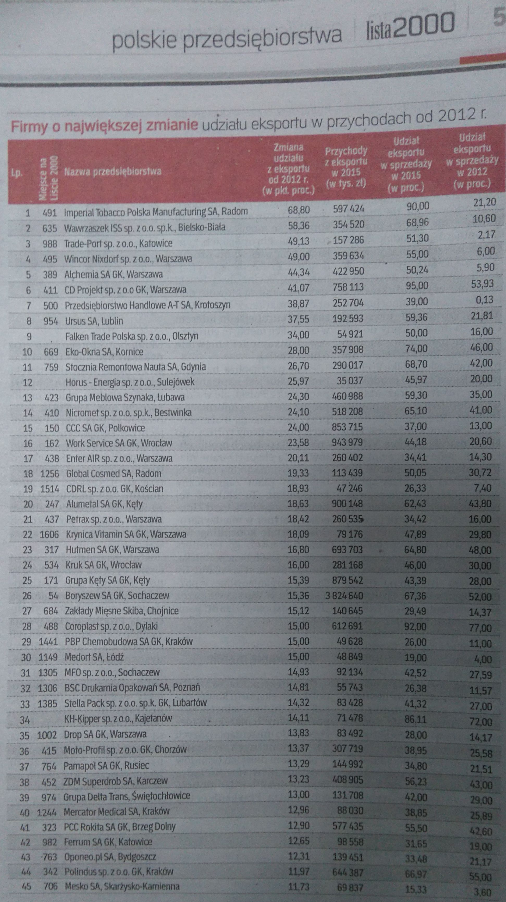

W tym tygodniu zajęłam się tabelą z dodatku do  Rzeczpospolitej dotyczącego przedsiębiorstw z "Listy 2000".
W dodatku tym znalazła się tabela:




Wybrałam z niej 6 pierwszych rekordów i dla nich stworzyłam prosty wykres animowany.

Adres: https://jsfiddle.net/flaminka/1j28n8b3/

Kod z części html:

```{r, eval=F}
<div class="hello">

  <svg width="800" height="600">
    <g />
    <rect x="1" y="5" width="800" height="0" />
</div>
```

Kod z części css:

```{r, eval=F}
 div.hello{
  background-color: white;
}

.grid .tick {
    stroke: grey;
    opacity: 0.2;
}

.axis text {
				font-family: Helvetica;
				font-size: 14px;
			}

>
```


Kod z części javascript:

```{r, eval=F}
 var danekr = [{"firma":"CD Projekt","udzial2012":53.93,"udzial2015":95,"przychody2015":758113,"roznica":41.07,"pozycja":6},{"firma":"Alchemia","udzial2012":5.9,"udzial2015":50.24,"przychody2015":422950,"roznica":44.34,"pozycja":5},{"firma":"Wincor Nixdorf","udzial2012":6,"udzial2015":55,"przychody2015":359634,"roznica":49,"pozycja":4},{"firma":"Trade-Port","udzial2012":2.17,"udzial2015":51.3,"przychody2015":157286,"roznica":49.13,"pozycja":3},{"firma":"Wawrzaszek ISS","udzial2012":10.6,"udzial2015":68.96,"przychody2015":354520,"roznica":58.36,"pozycja":2},{"firma":"Imperial Tobacco","udzial2012":21.2,"udzial2015":90,"przychody2015":597424,"roznica":68.8,"pozycja":1}] 


 var w = 800,
   h = 600

 var x = d3.scale.ordinal()
   .domain( danekr.map( function (d){
   return d.firma
   }))
   .rangeBands([0, w-50], 0.4)

 // y is also a function!
 var y = d3.scale.linear()
   .domain([0, 100])
   .range([h, 100])


 var svg = d3.select("g")
     .attr("transform", "translate(" + 40 + "," + -30 + ")")
 
 var xAxisG = svg.append("g")
        .attr("class", "x axis")
        .attr("transform", "translate(" + 0+ "," + h + ")")
        
 var yAxisG = svg.append("g")
        .attr("class", "y axis")
        .attr("class", "grid")
   
        
   var xAxis = d3.svg.axis().scale(x).orient("bottom")
        .outerTickSize(1)
 
        


   var yAxis = d3.svg.axis().scale(y).orient("left")
        .ticks(12)                  
        .outerTickSize(1)
        .tickSize(-710, 1)
 
     
        xAxisG.call(xAxis)
        yAxisG.call(yAxis)

var line = d3.svg.line()
    .x(function(d) { return x(d.x); })
    .y(function(d) { return y(d.y); });


    var tytul = svg.append("text")
        .attr("x", 0 )          
        .attr("y", 60)  
        .style("font-size", "24px")
        .style("font-weight", "bold")
        .style("font-family", "Helvetica")
        .text("Firmy z największą zmianą udziału eksportu w przychodach [%]")
        
        .transition()
        .transition()
        .delay(3000)
        .duration(3000)
        .style("opacity",0)
        
        .transition()
        .delay(6000)
   			.duration(3000)
        .text("Udział eksportu w przychodach [%]")
        .style("opacity",1)
        
        
        .transition()
        .transition()
        .delay(28000)
        .duration(3000)
        .style("opacity",0)
        
        
        .transition()
        .delay(32000)
   			.duration(3000)
        .text("Zmiana udziału eksportu w przychodach [%]")
        .style("opacity",1)
        
    var podtytul = svg.append("text")
        .attr("x", 0 )          
        .attr("y", 90)  
        .style("font-size", "18px")
        .style("font-weight", "bold")
        .style("font-family", "Helvetica")
        .text("w latach 2012-2015")
       
       
        .transition()
        .delay(3000)
        .duration(3000)
        .style("opacity",0)
    
        .transition()
        .delay(6000)
   			.duration(3000)
        .text("w roku 2012")
        .style("opacity",1)
       
        
        .transition()
        .delay(16000)
        .duration(3000)
        .style("opacity",0)
        
        
        .transition()
        .delay(20000)
   			.duration(3000)
        .text("w roku 2015")
        .style("opacity",1)
        
        .transition()
        .delay(28000)
        .duration(3000)
        .style("opacity",0)
        
        
        .transition()
        .delay(32000)
   			.duration(3000)
        .text("w latach 2012-2015")
        .style("opacity",1)
        
        
  var rok12 = svg.append("text")
        .attr("x", 720 )          
        .attr("y", h-100)  
        .style("font-size", "18px")
        .style("font-weight", "bold")
        .style("font-family", "Helvetica")
        .text("'12'")
        .style("opacity",0)
        
        .transition()
        .delay(32000)
   			.duration(3000)
        .style("opacity",1)
        
    
       
  var rok15 = svg.append("text")
        .attr("x", 720 )          
        .attr("y", 150)  
        .style("font-size", "18px")
        .style("font-weight", "bold")
        .style("font-family", "Helvetica")
        .text("'15'")
        .style("opacity",0)
        
        .transition()
        .delay(32000)
   			.duration(3000)
        .style("opacity",1)
        
        
        
 
  
svg.selectAll("rect")
   .data(danekr).enter().append("rect")
   .attr("y",  function(d, i) {
     return y(d.roznica)
   })
   .attr("x",  function (d){ 
   			return  x(d.firma) 
        })
   .attr("width", x.rangeBand())
   .attr("height", function(d, i) {
     return h - y(d.roznica)
   })
   .style("fill", "#feab5d")
   
   // chowanie slupkow zmiany
   .transition()
   .delay(3000)
   .duration(3000)
    .attr("y",  function(d, i) {
     return h
   })
   .attr("x",  function (d){ 
   			return  x(d.firma) 
        })
   .attr("width", x.rangeBand())
   .attr("height", function(d, i) {
     return 0
   })
   .style("fill", "#feab5d")
   
   // pojawienie sie slupkow 
    .transition()
   .duration(5000)
   .attr("y",  function(d, i) {
     return y(d.udzial2012)
   })
   .attr("x",  function (d){ 
   			return  x(d.firma) 
        })
   .attr("width", x.rangeBand())
   .attr("height", function(d, i) {
     return h - y(d.udzial2012)
   })
   .style("fill", "#73c2e0")
   
 
   
 	// zmiana słupkow na kreski
  
    .transition()
   	.duration(6000)
   .attr("y",  function(d, i) {
     return y(d.udzial2012)
   })
   .attr("x",  function (d){ 
   			return  x(d.firma) 
        })
   .attr("width", x.rangeBand())
   .attr("height", function(d, i) {
     return `5`
   })
   .style("fill", "#73c2e0")
   
   // slupki za rok 2015
  
   .transition()
   .duration(6000)
   .attr("y",  function(d, i) {
     return y(d.udzial2015)
   })
   .attr("x",  function (d){ 
   			return  x(d.firma) 
        })
   .attr("width", x.rangeBand())
   .attr("height", function(d, i) {
     return h - y(d.udzial2015)
   })
   .style("fill", "#d5effc")
   
    .transition()
   	.duration(6000)
   .attr("y",  function(d, i) {
     return y(d.udzial2015)
   })
   .attr("x",  function (d){ 
   			return  x(d.firma) 
        })
   .attr("width", x.rangeBand())
   .attr("height", function(d, i) {
     return `5`
   })
   .style("fill", "#d5effc")
   
    
    .transition()
   	.duration(7000)
   .attr("y",  function(d, i) {
     return y(d.udzial2015)
   })
   .attr("x",  function (d){ 
   			return  x(d.firma) 
        })
   .attr("width", x.rangeBand())
   .attr("height", function(d, i) {
     return h-y(d.roznica)
   })
   .style("fill", "#feab5d")
   
        
```

