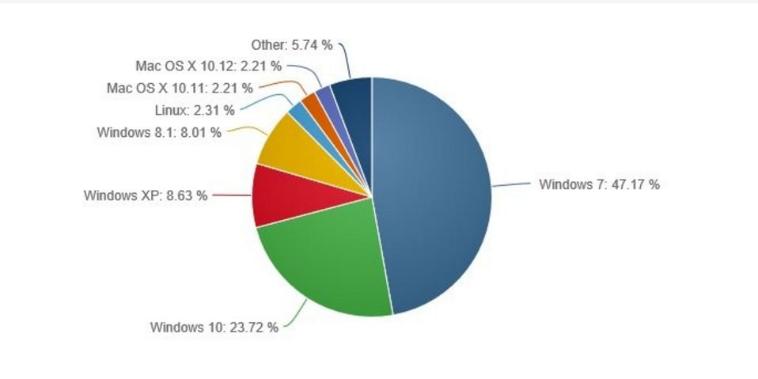

W tym tygodniu zajęłam się danymi ze strony http://www.digitaltrends.com/computing/windows-10-24-percent-marke-share/, dotyczącymi udziału różnych systemów operacyjnych w segmencie komputerów osobistych. Grafika przedstawiona w artykule wyglądała tak:



Postanowiłam ją trochę ożywić, tworząc wykres typu "the everything" (link do wykresu: https://jsfiddle.net/flaminka/2eyoxeun/).

Wykres składa się z siatki szarych kół, których barwa zmienia się wraz z czasem zgodnie z kolorem wyznaczonym przez daną grupę. Jednocześnie po zakończeniu kolorowania danej grupy kółek, w legendzie pojawia się informacja jakiego systemu operacyjnego dany kolor dotyczy wraz z dokładnym procentem odnoszącym się do udziału tego systemu w rynku PC. Kolory, oprócz tego, że miały ułatwić szybkie rozróżnianie poszczególnych grup, są dla Windowsa i Linuxa skojarzone z ich logiem (czerwony,niebieski,zielony i żółty kwadrat dla Microsoftu oraz pomarańczowe elementy pingwina dla Linuxa). Poniżej wykresu umieszczone jest hiperłącze do źródła danych.

Kod wykresu:

HTML:

```{r, eval=F}
<div class="center-block">
		<div id="svg"></div>
		<h3>
			Źródło danych: <a href="http://www.digitaltrends.com/computing/windows-10-24-percent-marke-share/" target="_blank">Digital Trends, 01.12.2016</a> 
		</h3>
	</div>
```

CSS:

```{r, eval=F}
.center-block {
	  display: block;
	  margin-right: auto;
	  margin-left: auto;
	  margin-top: 50px;
	}

	body {
	  font: 11px sans-serif;
	  color: grey;
	  text-align: center;
	  background:white;
	}
	svg{
		background-color: white;
	}
	.graph{
		stroke-width: 0;
	}
```

JavaScript:

```{r,eval=F}
 // ustawic biblioteke D3!!!


// DANE

var dane = [{"system":"Windows 7","procenty":47.17,"procenty_text":"47.17%","zaokr":47,"skum":47},{"system":"Windows 10","procenty":23.72,"procenty_text":"23.72%","zaokr":24,"skum":71},{"system":"Windows XP","procenty":8.63,"procenty_text":"8.63%","zaokr":9,"skum":80},{"system":"Windows 8.1","procenty":8.01,"procenty_text":"8.01%","zaokr":8,"skum":88},{"system":"Linux","procenty":2.31,"procenty_text":"2.31%","zaokr":2,"skum":90},{"system":"Mac OS X 10.11","procenty":2.21,"procenty_text":"2.21%","zaokr":2,"skum":92},{"system":"Mac OS X 10.12","procenty":2.21,"procenty_text":"2.21%","zaokr":2,"skum":94},{"system":"Inne","procenty":5.74,"procenty_text":"5.74%","zaokr":6,"skum":100}] 

var siatka =[{"x":1,"y":10},{"x":2,"y":10},{"x":3,"y":10},{"x":4,"y":10},{"x":5,"y":10},{"x":6,"y":10},{"x":7,"y":10},{"x":8,"y":10},{"x":9,"y":10},{"x":10,"y":10},{"x":10,"y":9},{"x":9,"y":9},{"x":8,"y":9},{"x":7,"y":9},{"x":6,"y":9},{"x":5,"y":9},{"x":4,"y":9},{"x":3,"y":9},{"x":2,"y":9},{"x":1,"y":9},{"x":1,"y":8},{"x":2,"y":8},{"x":3,"y":8},{"x":4,"y":8},{"x":5,"y":8},{"x":6,"y":8},{"x":7,"y":8},{"x":8,"y":8},{"x":9,"y":8},{"x":10,"y":8},{"x":10,"y":7},{"x":9,"y":7},{"x":8,"y":7},{"x":7,"y":7},{"x":6,"y":7},{"x":5,"y":7},{"x":4,"y":7},{"x":3,"y":7},{"x":2,"y":7},{"x":1,"y":7},{"x":1,"y":6},{"x":2,"y":6},{"x":3,"y":6},{"x":4,"y":6},{"x":5,"y":6},{"x":6,"y":6},{"x":7,"y":6},{"x":8,"y":6},{"x":9,"y":6},{"x":10,"y":6},{"x":10,"y":5},{"x":9,"y":5},{"x":8,"y":5},{"x":7,"y":5},{"x":6,"y":5},{"x":5,"y":5},{"x":4,"y":5},{"x":3,"y":5},{"x":2,"y":5},{"x":1,"y":5},{"x":1,"y":4},{"x":2,"y":4},{"x":3,"y":4},{"x":4,"y":4},{"x":5,"y":4},{"x":6,"y":4},{"x":7,"y":4},{"x":8,"y":4},{"x":9,"y":4},{"x":10,"y":4},{"x":10,"y":3},{"x":9,"y":3},{"x":8,"y":3},{"x":7,"y":3},{"x":6,"y":3},{"x":5,"y":3},{"x":4,"y":3},{"x":3,"y":3},{"x":2,"y":3},{"x":1,"y":3},{"x":1,"y":2},{"x":2,"y":2},{"x":3,"y":2},{"x":4,"y":2},{"x":5,"y":2},{"x":6,"y":2},{"x":7,"y":2},{"x":8,"y":2},{"x":9,"y":2},{"x":10,"y":2},{"x":10,"y":1},{"x":9,"y":1},{"x":8,"y":1},{"x":7,"y":1},{"x":6,"y":1},{"x":5,"y":1},{"x":4,"y":1},{"x":3,"y":1},{"x":2,"y":1},{"x":1,"y":1}] 

var colors = ["#8dd3c7","#bc80bd","#fccde5","#fdb462","#b3de69","#ffed6f", "#80b1d3", "#fb8072"]

// ustawienia grafiki

                      var margin = {top: 30, right: 50, bottom: 160, left: 50},
                      width = 800 - margin.left - margin.right,
                      height = 500 - margin.top - margin.bottom,
                      grid = 40;


                      var svg = d3.select('#svg')
                      .append("svg")
                      .attr("width", width + margin.left + margin.right)
                      .attr("height", height + margin.top + margin.bottom)
                      .append('g')
                      .attr('transform', 'translate(' + margin.left + "," + margin.top + ")");

// tytul

                      var tytul = svg.append('g')
                      .attr('class', 'head')
                      .attr("transform", "translate(" + 10 + ", 5)")
                      .style('text-anchor', 'left');

                      tytul.append('text')
                      .style('font-size', '27px')
                      .text('Udział poszczególnych systemów operacyjnych na rynku PC');

// wykres
                      svg = svg.append('g').
                      attr('transform', 'translate(' + -35 + ',' + (margin.top-10) + ')');


                      var koleczka = svg.selectAll(".graph")
                      .data(siatka);

                      koleczka.enter().append("rect")
                      .attr("x", function(d) { return (d.x * grid); })
                      .attr("y", function(d) { return (d.y * grid); })
                      .attr("rx", 100)
                      .attr("ry", 100)
                      .attr("width", grid)
                      .attr("height", grid)
                      .style("fill", "#D3D3D3")
                      .style("stroke", "#444a4c")

// koleczka zmieniaja kolory

                      .transition()
                      .duration(1000)
                      .delay(function(d, i){

                         if(i < dane[0].skum){
                            return i *200;
                         }
                         if(i < dane[1].skum){
                            return i * 200 + 1*3000;
                         }
                         if(i < dane[2].skum){
                            return i * 200 + 2*3000;
                         }
                         if(i < dane[3].skum){
                            return i * 200 + 3*3000;
                         }
                         if(i < dane[4].skum){
                            return i * 200 + 4*3000;
                         }
                         if(i < dane[5].skum){
                            return i * 200 + 5*3000;
                         }
                         if(i < dane[6].skum){
                            return i * 200 + 6*3000;
                         }
                         else{
                            return i * 200 + 7*3000;
                         }
                      })

                      .style("fill", function(d,i){

                         if(i < dane[0].skum){
                            return colors[7];
                         }
                         else if(i < dane[1].skum){
                            return colors[6];
                         }
                         else if(i <dane[2].skum){
                            return colors[5];
                         }
                         else if(i < dane[3].skum){
                            return colors[4];
                         }
                         else if(i < dane[4].skum){
                            return colors[3];
                         }
                         else if(i < dane[5].skum){
                            return colors[2];
                         }
                         else if(i <dane[6].skum){
                            return colors[1];
                         }
                         else{
                            return colors[0];
                         }
                      })


// legenda
                      var legend = svg.selectAll('.legend')
                      .data(colors.reverse())
                      .enter()
                      .append('g')
                      .attr('class', 'legend');

                      legend.append('rect')
                      .attr('class', 'legends')
                      .attr('y', function(d, i){
                         return height -(i *33)+30;
                      })
                      .attr('x', 510)
                      .attr("rx", 50)
                      .attr("ry", 50)
                      .attr('width', 25)
                      .attr('height', 25)
                      .attr('fill', function(d, i){
                         return colors[i];
                      })
                      .attr('stroke', "#444a4c")


                      legend.append('text')
                      .attr('x', function(d, i){
                         return 550;
                      })
                      .attr('y', function(d,i){
                         return (358 - i *33 );
                      })
                      .text(function(d, i){
                         return dane[i].system + " (" + dane[i].procenty_text + ")";
                      })
                      .attr("font-size","16px")
                      .attr("opacity", 0)
                      
                      .transition()
                      .duration(2000)
                      .delay(function(d,i){
                        return (i*3000 + dane[i].skum*200+800);
                      })
                      .attr("opacity", 1)
```

