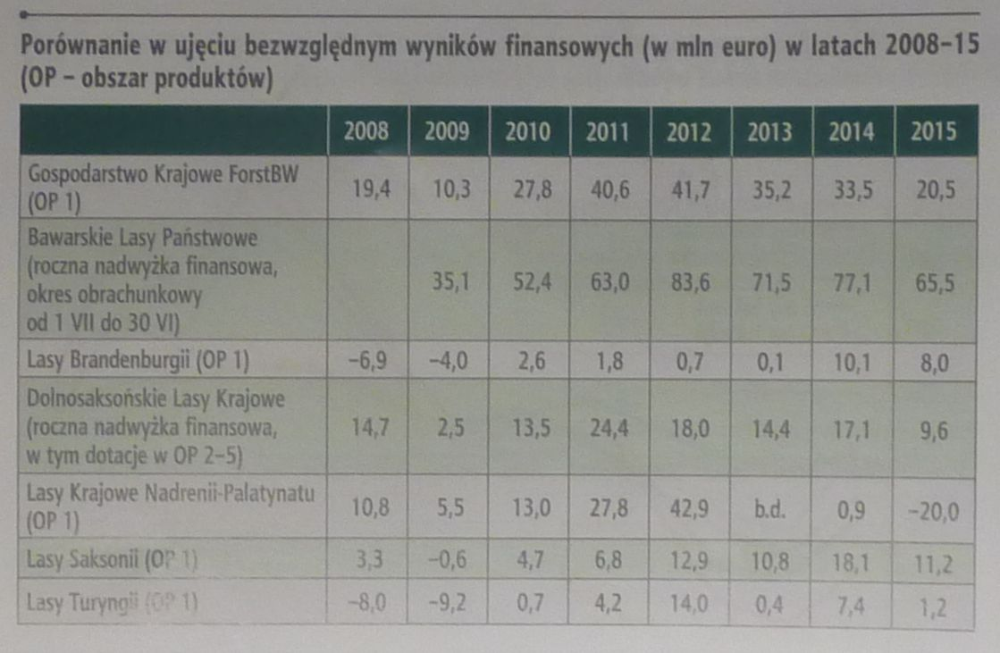

```{r setup, include=FALSE}
knitr::opts_chunk$set(echo = TRUE)
```

Do tej pracy domowej użyłam danych z artykułu "Niemcy - wyniki ekonomiczne w 2015 roku" z magazynu "Las Polski", wydanie 23, 1-15 grudnia 2015 roku. Poniższa tabelka prezentuje wykorzystane dane:



Lasy Państwowe w Niemczech są zarządzane przez landy - w każdym landzie funckjonuje podmiot, który zarządza na danym obszarze gospodarką leśną. Podmioty te funckjonują w pewnym sensie niezależnie od siebie (w Polsce mamy odgórne zarządzanie Lasami Państwowymi, jeśli mogę to tak ująć, poszczególne jednostki podlegają pod Dyrekcję Generalną LP, podczas gdy w Niemczech, jednostki te działają bardziej niezależnie), co wiąże się m.in. z różnym sposobem definiowania przychodów ( np. (nie)włączanie dotacji państwowych do nich). Ciężko jest zatem porównywać do siebie dane przedstawione w tabeli. Mówią one nam raczej ogólnie o rzędach wielkości i tendencjach - i te kwestie postaram się odpowiednio zobrazować na wykresie.

Dodatkowym czynnikiem utrudniającym te porównania są różnorodne warunki środowiskowe (górzystość terenu, skład gatunkowy lasów etc.), dlatego autor artykułu wybrał jedynie 7 landów, które dobrze reprezentowały podaną wyżej różnorodność. Z mojej strony postaram się ułatwić odbiorcy lokalizację i wielkość wybranych landów.

Problemami/wyzwaniami związanymi z tymi danymi była ilość kategorii (aż 7 podmiotów), braki danych dla 2 podmiotów oraz różne rzędy wielkości podanych liczb. Typowy wykres liniowy, który pokazałby zarówno tendencje w czasie jak i porównanie wielkości wyników dla poszczególnych podmiotów nie spełniał dobrze swojego zadania - 7 linii ukazanych na jednym wykresie oraz urywanie się linii dla LK Nadrenii-Palatynu dla roku 2013 sprawiało, że wykres był nieczytelny. Zdecydowałam sie na użycie wykresu słupkowego w podziale na podmioty. Dodatkowo, aby zorientować się co do położenia i wielkości poszczególnych landów w Niemczech dodałam mapę z zaznaczonymi wybranymi obszarami oraz aby szybko porównać wielkości wyników finansowych per rok (a nie per land, jak umożliwia to wykres) dodałam tabelę-heatmapę z surowymi danymi. Wszystkie 3 elementy umieściłam w jednym panelu i powiązałam ze sobą.  Jeśli interesuje nas tylko jeden land możemy kliknąć na legendę w odpowiedni napis - wówczas na wszystkich 3 wykresach zostanie podświetlony tylko 1 element związany z wybranym landem. Możliwe jest również rozpoczęcie analizy od mapy - po kliknięciu na land, pozostałe 2 elementy będą zawierały tylko wiersz/wykres słupkowy dla danego landu (kliknięcie na legendę zostawiało całe wykresy, tyle że zaciemniało nieaktywne landy). Każdy wykres jest zaopatrzony w tooltipy, które dostarczają natychmiastowych informacji o wybranym elemencie danych.

Co do treści wykresów. Na wykresie możemy zaobserwować np., że
    - największe wyniki finansowe osiągały Bawarskie LP, najmniejsze Lasy Brandenburgii
    - LK Nadrenii-Palatynatu skończyły rok na dużym minusie
    - żadnemu z rozważanym podmiotów nie udało się utrzymać w 2015 roku wyniku z roku poprzedniego.

Wykres jest dostępny pod adresem:
https://public.tableau.com/views/praca_dom_lasy_wieksze/Dashboard1?:embed=y&:display_count=yes

