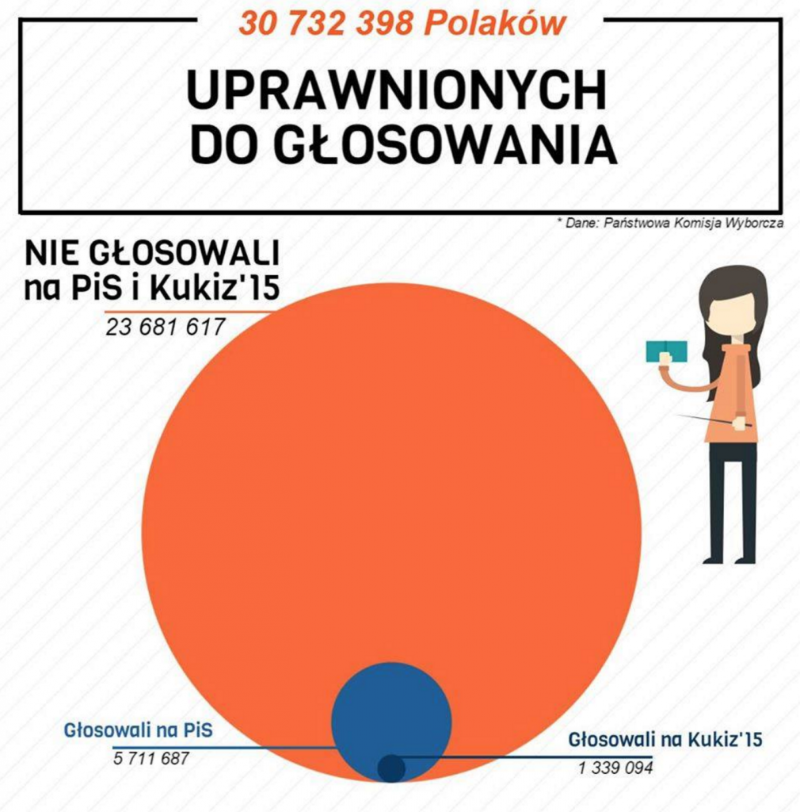
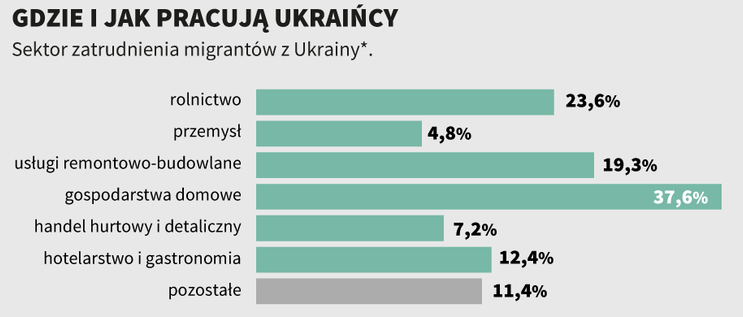
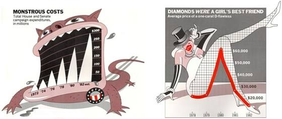
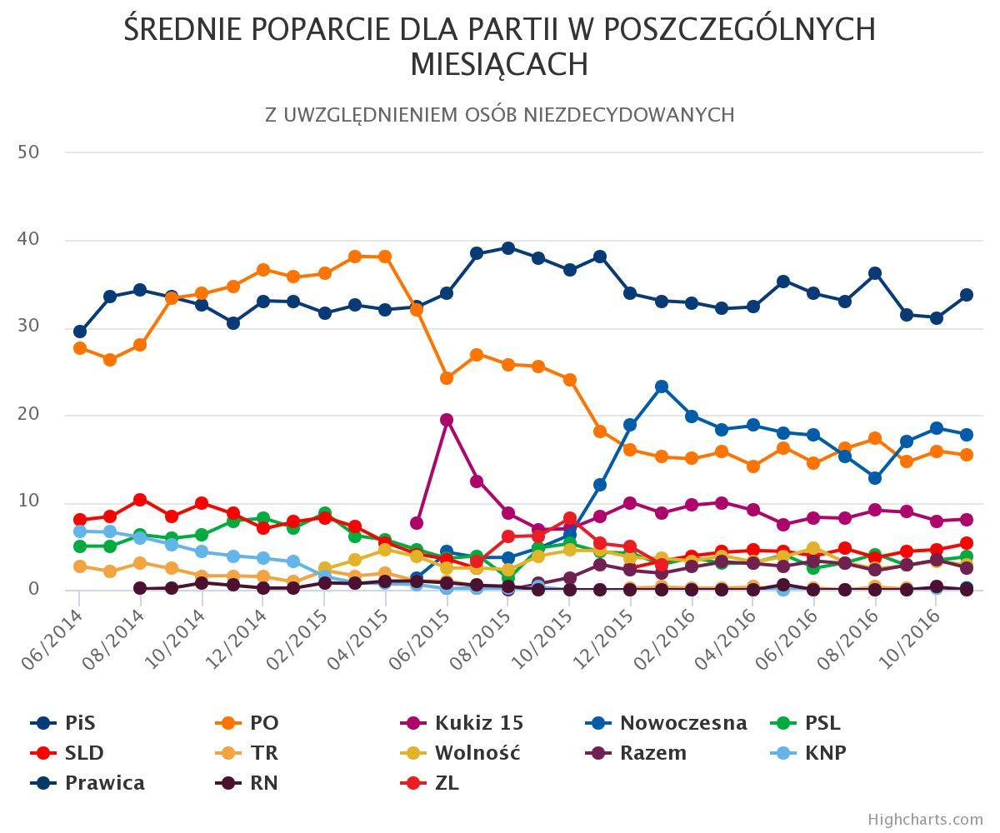

## 9 zasad
<font size="6">
1. Odbiorca  
2. Przekaz  
3. Środek przekazu  
4. Opis  
5. Podstawowe ustawienia  
6. Skutecznie używaj kolorów  
7. Nie wprowadzaj odbiorcy w błąd  
8. Nie ,, zaśmiecaj '' wykresów  
9. Wybierz odpowiednie narzędzie  

</font>

## 1. Odbiorca

<font size="4">
Musimy pamiętać, kto będzie naszym odbiorcą, czy student, dla którego dodatkowe informacje będą adekwatne, czy będzie to to grupa osób z danej dziedziny naukowej.

<a href="http://journals.plos.org/ploscompbiol/article/file?type=large&id=info:doi/10.1371/journal.pcbi.1003833.g001">
Wykres1
</a>

</font>


## 2. Przekaz

<font size="4">
Zanim zaczniemy tworzyć czy rysować wykres, powinniśmy się zastanowić jaką wiadomość chcemy przekazać za jego pomocą.

<a href="http://journals.plos.org/ploscompbiol/article/file?type=large&id=info:doi/10.1371/journal.pcbi.1003833.g002">
Wykres2
</a>

</font>


## 3. Środek przekazu

<font size="4">
Jeśli nasz wykres będzie wyświetlony jako slajd, warto pamiętać, aby go uprościć (przybliżając interesującą część), powiększyć czcionkę, zmienić kolory.

<a href="http://journals.plos.org/ploscompbiol/article/file?type=large&id=info:doi/10.1371/journal.pcbi.1003833.g003">
Wykres3
</a>

</font>


## 4. Opis

<font size="4">
Nie wszystko można wyczytać, czy umieścić na wykresie. Jeśli wartości liczbowe są istotną informacją, to muszą być one umieszczone w opisie wykresu, bądź na wykresie, ale w przejrzysty sposób.

Zasada ta działa w dwie strony. Jeżeli na wykresie jest obiekt ważny do zaobserwowania, np. obserwacja odstająca, należy go wyszczególnić (inny kształt, kolor), ale również napisać o istenieniu tego punktu w opisie wykresu.
</font>

## 5. Podstawowe ustawienia

<font size="4">
Aby nasza wiadomość lepiej dotarła do odbiorców warto zmienić ustawienia podstawowe. Dostostować wykres do przekazywanej wiadomości.

<a href="http://journals.plos.org/ploscompbiol/article/file?type=large&id=info:doi/10.1371/journal.pcbi.1003833.g004">
Wykres4
</a>

</font>


## 6. Skutecznie używaj kolorów
<font size="5">

* Stosuj kolor tylko, aby służyły konkretnemu celowi komunikacyjnemu, a nie wizualnemu.
* Jeżeli chcemy, aby różne obiekty tego samego koloru wyglądały tak samo, upewnijmy się, że kolor je otaczający, jest identyczny.
* Jeżeli chcemy, aby obiekty w tabeli lub na wykresie były łatwo dostrzegalne, używajmy koloru tła, który będzie wystarczająco kontrastować z tymi obiektami.
* Używając koloru do prezentacji sekwencyjnego zakresu wartości liczbowych, należy trzymać się pojedynczej barwy (lub niewielkiego zestawu blisko związanych barw) i zmieniać intensywność od jasnych kolorów dla niskich wartości do ciemniejszych i wyraźniejszych kolorów dla wartości wyższych.
* Aby zapewnić daltonistom możliwość rozróżnienia grup danych, które są w różnych kolorach, należy unikać umieszczania na jednym obrazie czerwonego i zielonego.

</font>


## 7. Nie wprowadzaj odbiorcy w błąd

<font size="4">
Jeżeli używane oprogramowanie automatycznie przeskalowuje wartości, możesz otrzymać obiekt, który mimo obiektywnego przedstawienia danych, będzie nieumyślnie przekonywać odbiorcę do wiary w zależności, które widzi choć ich nie ma.
</font>

<center>
```{r, echo=FALSE, out.width = "400px"}

```
</center>


## 7. Nie wprowadzaj odbiorcy w błąd

<font size="4">
Pamiętaj, aby używać typu wykresu odpowiedniego do przekazywanej informacji oraz sprawdzić, czy umieszczone wartości i etykiety odpowiadają danym.
</font>

<center>
```{r, echo=FALSE, out.width = "650px"}

```
</center>


## 8. Nie ,, zaśmiecaj '' wykresów

<font size="4">
Wykres śmieciowy to taki, w którym informacja ginie wśród nadmiaru rozpraszających elementów, bądą po prostu ładnie wyglądać, nie przekazując nic istotnego. Głównym celem tworzenia wykresu jest dotarcie z czytelnym komunikatem do odbiorcy. 
</font>

<center>
```{r, echo=FALSE, out.width = "650px"}

```
</center>


## 8. Nie ,, zaśmiecaj '' wykresów

<center>
```{r, echo=FALSE, out.width = "650px"}

```
</center>


## 9. Wybierz odpowiednie narzędzie

<font size="4">
Mamy wiele narzędzi, które ułatwiają tworzenie nowych obiektów, a ich znajomość może pomóc zaoszczędzić mnóstwo czasu.  
Bazując na wiedzy o efekcie wizualnym jaki chcemy uzyskać, wybierajmy program dedykowany naszemu celowi. 

</font>


