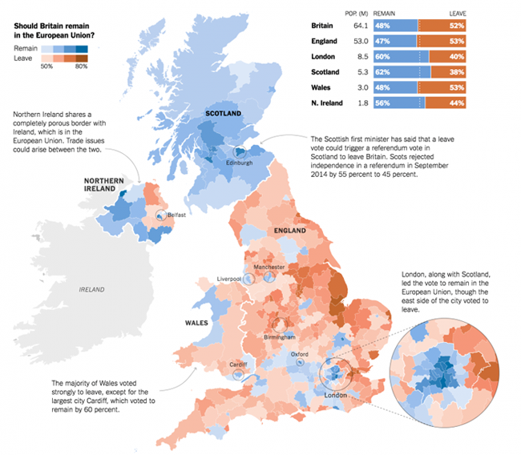
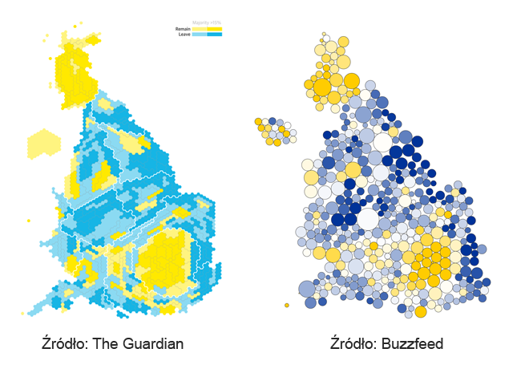
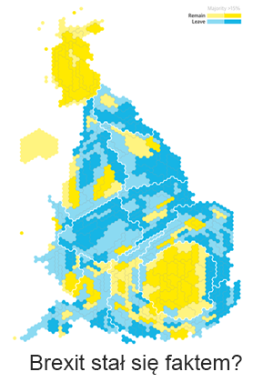
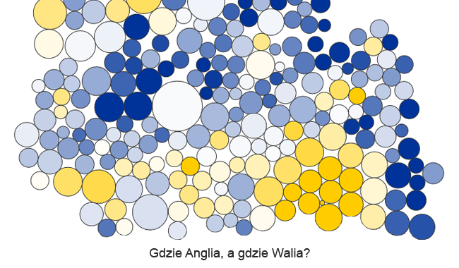
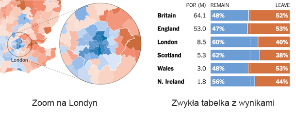
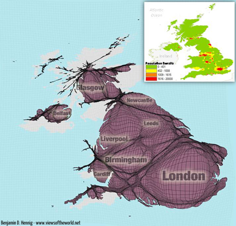

# Definicja i zastosowanie

## Definicja 

<b>Kartogram</b> jest to jedna z kartograficznych metod prezentacji, sposób przedstawienia średniej wartości dowolnego zjawiska w określonych jednostkach przestrzennych (administracyjnych lub geometrycznych) zwanych polami podstawowymi lub jednostkami odniesienia.

## Przykładowe zastosowanie

Często używa się tej metody do przedstawienia gęstości zaludnienia w określonych jednostkach administracyjnych (województwach, państwach, itp.).

# Mapa a kartogramy

## Mapa

## Kartogramy

# Ale...

## 

Kartogramy są mało czytelne dla osób niezaznajomionych   z geografią.

##

Rozpoznawanie i porównywanie obszarów jest ciężkie.

##

Utrata informacji wynikających z obszarów geograficznych.

##

Kartogramy są cięższe do oznaczania.

##

Są inne sposoby do pokazania tego samego problemu.

# Ale ale...

## Kartogramy mogą być nadal fajne

# Bibliografia

## Bibliografia

- http://vis4.net/blog/posts/to-cartogram-or-not-to-cartogram-the-brexit/
- http://www.viewsoftheworld.net/?p=676
- https://pl.wikipedia.org/wiki/Kartogram
